# ML4EARTH HACKATHON DATASET

<figure>
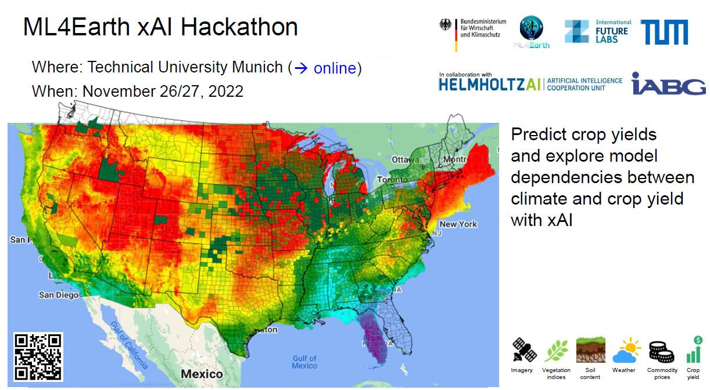
</figure>

&nbsp;

<strong style="color: red; opacity: 0.80;"></strong>

&nbsp;

&nbsp;
 

The [ML4Earth Hackathon](https://ml4earth.devpost.com/) seeks solutions to the pressing agricultural challenges of our time so that we can feed a growing global population under the influence of the climate crisis.
The challenge is to predict crop yields using machine learning and remote sensing. An already prepared dataset of crop yields, satellite imagery (MODIS), weather data, and climate indices for the United States will be made available. One goal is to study the dataset and develop new methods and models for crop prediction. Since most machine and deep learning models are black boxes and cannot be interpreted by humans, another goal is to open these black boxes and explore the learned model dependencies between climate and crop forecasting with explainable AI.

## Important Links
* The hackathon rules are given [here](https://ml4earth.devpost.com/).
* The starter pack notebook is given [here](https://github.com/zhu-xlab/ML4Earth-Hackathon-2022/blob/main/source/use_case_example.ipynb).
* The data reading functions are given under folder [source/datasets](https://github.com/zhu-xlab/ML4Earth-Hackathon-2022/tree/main/source/dataset) where:
    * *dataset_npy.py* is for reading the aggregated data for the participants with limited computational sources,
    * *dataset_tif.py* is for reading the raw data composed of layers of satellite images and climate variables.
* The **dataset** and use case introduction video can be found [download here](https://syncandshare.lrz.de/getlink/fiUh1RofUeMbugsSGD19QX/).
* The material to a short **xAI Tutorial** can be found [here](https://github.com/HelmholtzAI-Consultants-Munich/XAI-Tutorials/tree/ml4earth-Hackathon) (present at the Workshop on 22.11.22).

## Table of Contents

   - [1. Area of interest (ROI)](#sec_1)
   - [2. Data Format](#sec_2)
        - [2.a. Reflectance data](#sec_2a)
        - [2.b. Climate data](#sec_2b)
             - [2.b.i. Temperature and precipitation](#sec_2bi)
             - [2.b.ii. Heat/Cold wave index](#sec_2bii)
             - [2.b.iii. Drought index - USDM](#sec_2biii)
        - [2.c. Cropland data layer](#sec_2c)
        - [2.d. Yield data](#sec_2d)
        - [2.e. Geometry](#sec_2e)     
   - [3. Data Directory](#sec_3)
    
    

## 1. <a id="sec_1" /> Area of interest (ROI)
This section describes the ROI of satellite and climate data amassed for the [ML4Earth Hackathon](https://ml4earth.devpost.com/). The data covers top five corn growing states (Iowa, Illinois, Nebraska, Minnesota, Indiana) in the USA (Fig. [1](#FIG_1), [2](#FIG_2)) and it is temporally available from 2003 to 2021. Other dominant crops cultivated are soyabean and winter wheat.  The selected states also exhibit varying climatic characteristics (Fig. [3](#FIG_3))

<figure>
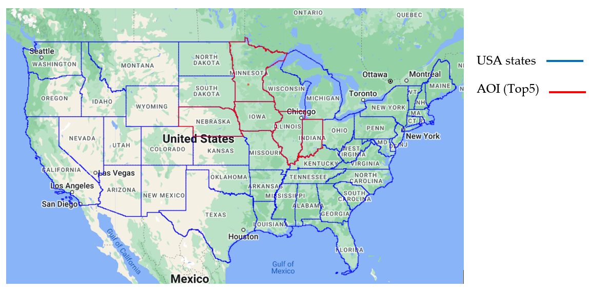
</figure>

<strong style="color: red; opacity: 0.80;">Figure 1: Map of study area (red outline).</strong>

&nbsp;

&nbsp;
 

<figure>

</figure>

<strong style="color: red; opacity: 0.80;">Figure 2: Average corn yield (in bushels per acre) for 2021.</strong>

&nbsp;

&nbsp;
 

<figure>

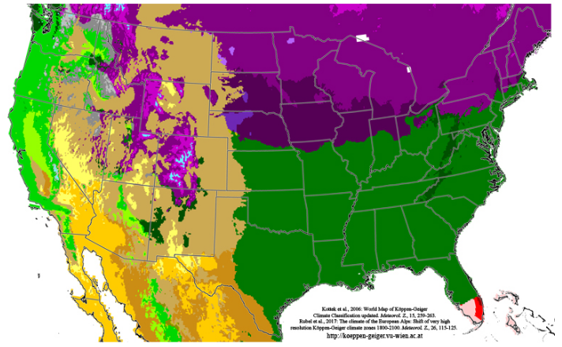

</figure>

<strong style="color: red; opacity: 0.80;">
Figure 3: Köppen-Geiger climate classification. Source: Universität Wien.</strong>

&nbsp;
 

## <a id="sec_2" /> 2. Data Format

The following section describes the satellite modalities and yield ground truth provided.

### <a id="sec_2a" /> 2.a. Reflectance data

The [MOD09A1](https://lpdaac.usgs.gov/documents/306/MOD09_User_Guide_V6.pdf) V6.1 product provides an estimate of the surface spectral reflectance of Terra MODIS bands 1-7 at 500m resolution and corrected for atmospheric conditions such as gasses, aerosols, and Rayleigh scattering. For each pixel, a value is selected from all the acquisitions within an 8-day composite based on high observation coverage, low view angle, the absence of clouds or cloud shadow, and aerosol loading.  The bands 1-7 corresponds to red, near-infra red (NIR), blue, green, near-infra red 2 (NIR2), short-wave infra-red 1 (SWIR1), short-wave infra-red 1 (SWIR2). Ideally, a total of 46 acquisitions are available yearly.

<figure>

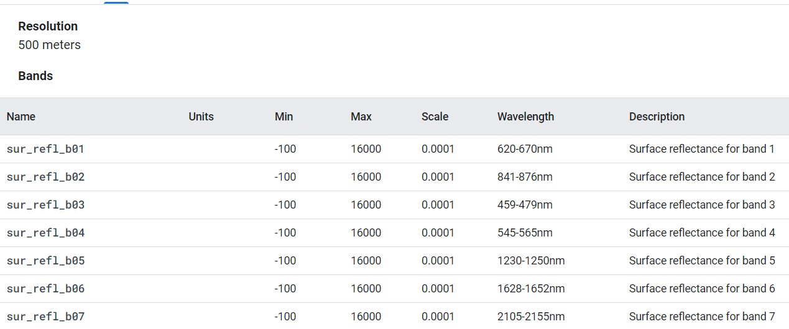

</figure>

<strong style="color: red; opacity: 0.80;">
Table 1: MODIS surface reflectance (source: Google Earth Engine).</strong>

&nbsp;
 

### <a id="sec_2b" /> 2.b. Climate data

#### <a id="sec_2bi" /> 2.b.i. Temperature and precipitation

[Daymet](https://daac.ornl.gov/DAYMET/guides/Daymet_Daily_V4.html) V4 provides gridded estimates of daily weather parameters for Continental North America at 1km spatial resolution. It is derived from selected meteorological station data and various supporting data sources.
Only a subset of the variables is provided for the hackathon. These include *minimum temperature*, *maximum temperature*, and *precipitation*.

#### <a id="sec_2bii" /> 2.b.ii. Heat/Cold wave index

The index is computed from Daymet temperature data from 1980 to 2021. The following structure is applied: A heat/cold wave needs to last at least 3 days and is encoded with a float point number from 0 to 1. While 0.1 describes all cold waves within the percentile of 10% of the coldest days, 0.9 describes a heat wave within the percentile of 10% of the hottest days. See [here](https://edo.jrc.ec.europa.eu/documents/factsheets/factsheet_heatColdWaveIndex.pdf) for more information.

#### <a id="sec_2biii" /> 2.b.iii. Drought Index – USDM

The U.S. Drought Monitor is a map released every Thursday, showing parts of the U.S. that are in drought. The map uses five classifications: abnormally dry (D0), showing areas that may be going into or are coming out of drought, and four levels of drought: moderate (D1), severe (D2), extreme (D3) and exceptional (D4).

<figure>

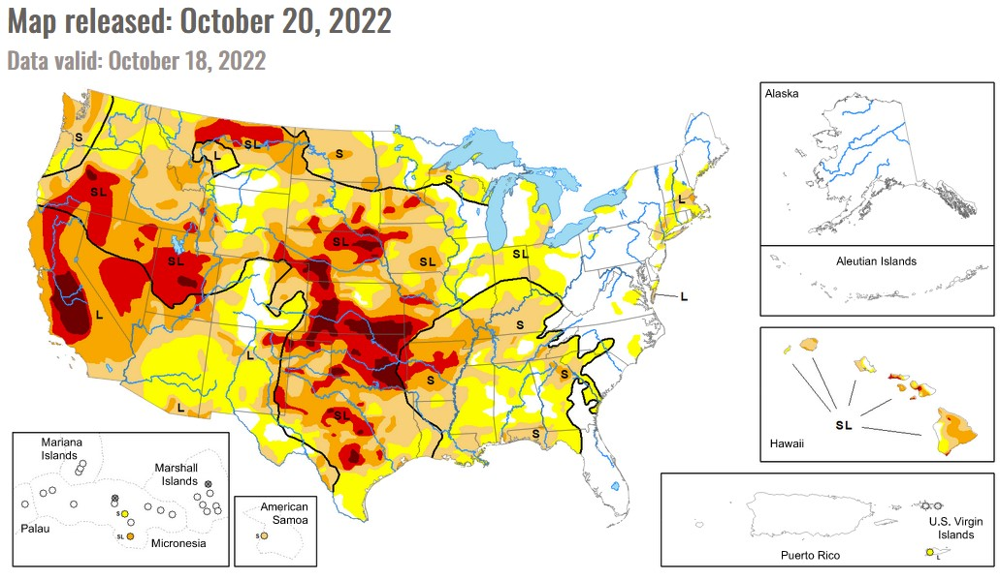

</figure>

<strong style="color: red; opacity: 0.80;">
Figure 4: Drought map of USA for Oct 20, 2022.</strong>

&nbsp;
 

It is not a statistical model, although numeric inputs are many: the Palmer Drought Severity Index, the Standardized Precipitation Index, and other climatological inputs; the Keech-Byram Drought Index for fire, satellite-based assessments of vegetation health, and various indicators of soil moisture; and hydrologic data, particularly in the West, such as the Surface Water Supply Index and snowpack.

Unlike most of the weather maps people see in the news, the U.S. Drought Monitor is not a forecast. In fact, it looks backward. It’s a weekly assessment of drought conditions, based on how much precipitation did or didn’t fall, up to the Tuesday morning before the map comes out. That gives authors about two working days to review the latest data. The data is provided as shape files.

The drought classes (Table [2]((#TAB_2))) will be encoded as integers: D0 - 1, D1 - 2, …, D4 - 5, and none of these classes is encoded as 0, with the meaning of no drought.

<figure>

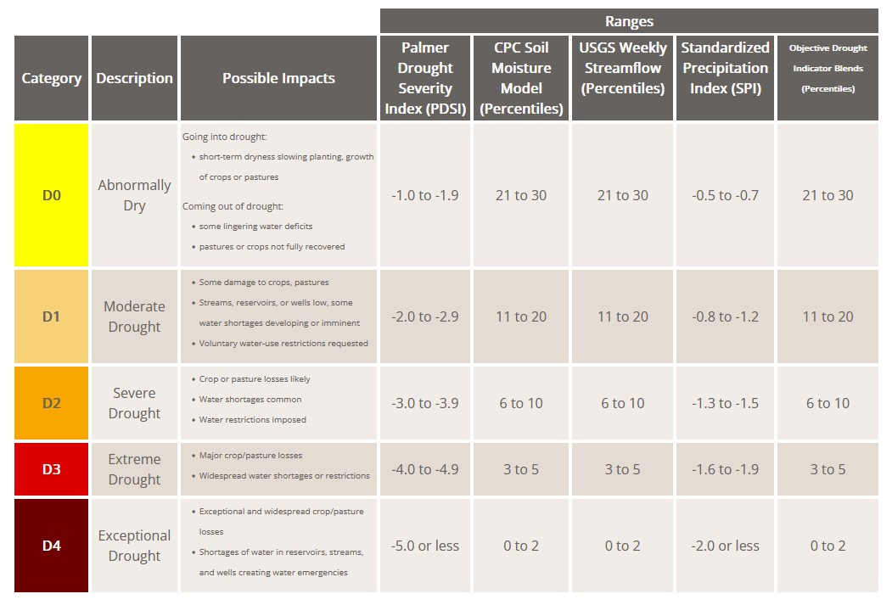

</figure>

<strong style="color: red; opacity: 0.80;">
Table 2: Drought index categories.</strong>

&nbsp;
 

### <a id="sec_2c" /> 2.c. Cropland data layer

The Cropland Data Layer (CDL) is a crop-specific land cover data layer created annually for the continental United States using moderate resolution satellite imagery (30m) and extensive agricultural ground truth. The CDL is created by the USDA, National Agricultural Statistics Service (NASS), Research and Development Division, Geospatial Information Branch, Spatial Analysis Research Section. The asset date is aligned with the calendar year of harvest. For most crops the planted and harvest year are the same. The following pixel values correspond to the prominent crop types in the 5 states. See crop calendar (Table [3](#TAB_3)) for planting and harvesting dates.

<figure>

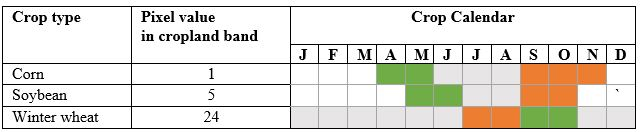

</figure>

<strong style="color: red; opacity: 0.80;">
Table 3: Crop type key, and crop calendar.</strong>

&nbsp;
 

### <a id="sec_2d" /> 2.d. Yield data

Harvested yield (in bushels per acre) at county level is obtained for corn, soyabean and winter wheat. The data in .csv format contains records for all 5 states; one for each crop type. Data is accessed from USDA NASS Quick Stats database. As an initial data cleaning step, incomplete records and columns not relevant to the task have been discarded. The Table [4](#TAB_4) below describes the remaining columns.

<figure>

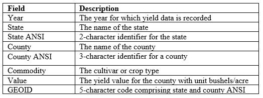

</figure>

<strong style="color: red; opacity: 0.80;">
Table 4: Details of fields in crop yield table.</strong>

&nbsp;
 

### <a id="sec_2e" /> 2.e. Geometry
The United States Census Bureau [TIGER](https://www2.census.gov/geo/pdfs/maps-data/data/tiger/tgrshp2018/TGRSHP2018_TechDoc.pdf) data contains the 2018 boundaries for primary legal divisions of US states. In most states, these entities are termed "counties" and it is the administrative unit for collecting crop yield data. A total of 473 counties are within the 5-selected states.

## <a id="sec_3" /> 3. Data Directory
All geospatial layers are provided in EPSG:4326 reference system. Daily Daymet data is temporally resampled by selecting an observation within the 8-day window of MODIS. For the weekly drought index, the dates closest to MODIS observation are used. 

A multi-modal EO data for each county is provided as .tif, clipped to the bounds of the county. Overlaps with neighbouring counties are therefore expected. All EO modalities have been resampled to the resolution of MODIS i.e. 500m. The resulting .tif file contains 13 channels corresponding to cropland (1), MODIS (2-8), Daymet (9-11), heat/cold wave (12), drought-index (13) with the following naming convention. 

      YYYYMMDD_SSCCC, where  
        YYYYMMDD: year, month, day 
        SS: state ID
        CCC: county ID

<figure>

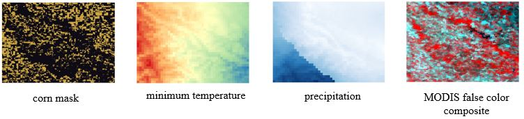

</figure>

<strong style="color: red; opacity: 0.80;">
Figure 5: Sample images.</strong>

&nbsp;
 

The dataset and its documentation are also provided [here](https://syncandshare.lrz.de/getlink/fiUh1RofUeMbugsSGD19QX/). 

<figure>

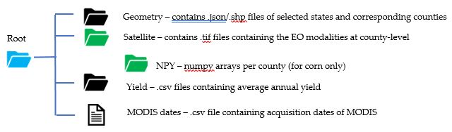

</figure>

<strong style="color: red; opacity: 0.80;">
Figure 6: Folder content.</strong>

&nbsp;
 

Optionally, we have provided numpy arrays (*.npy format*) for use where access to high computational power is limited. The arrays were derived by aggregating (averaging) each patch of EO data at locations corresponding to *corn* (also *soybean*). Each array has a dimension of *T x C* representing length of time series (46). Additionally, 3 vegetation indices (*NDVI*, *EVI* and *NDWI*) are pre-computed extending the number of channels from 12 to 15. 

The index of the channels corresponds to the following features.

<figure>

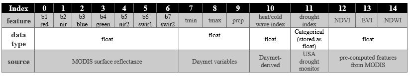

</figure>

<strong style="color: red; opacity: 0.80;">
Table 5: Index of features in .npy files.</strong>

&nbsp;
 

We recommend reading the yield tables as:

        df = pandas.read_csv('path/corn.csv',dtype=str) 

to avoid losing GEOID records with zero prefix. This in turn converts the Value field to string which can be reverted to float using 

        df['Value'] = df.apply(lambda row: float(row['Value']), axis=1)